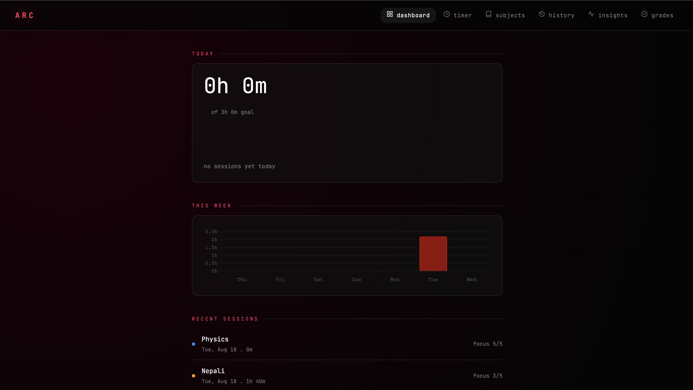
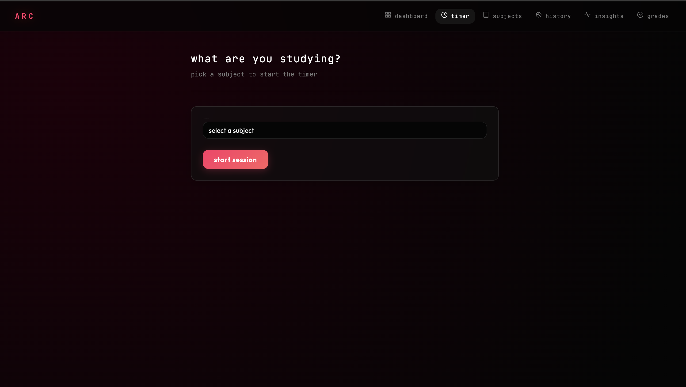
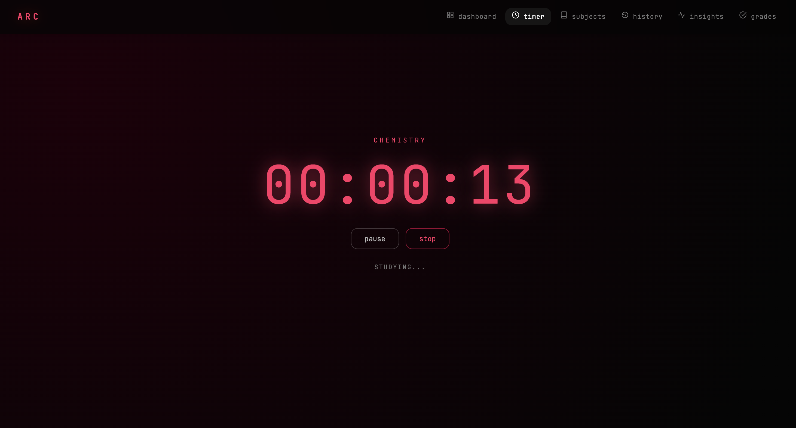
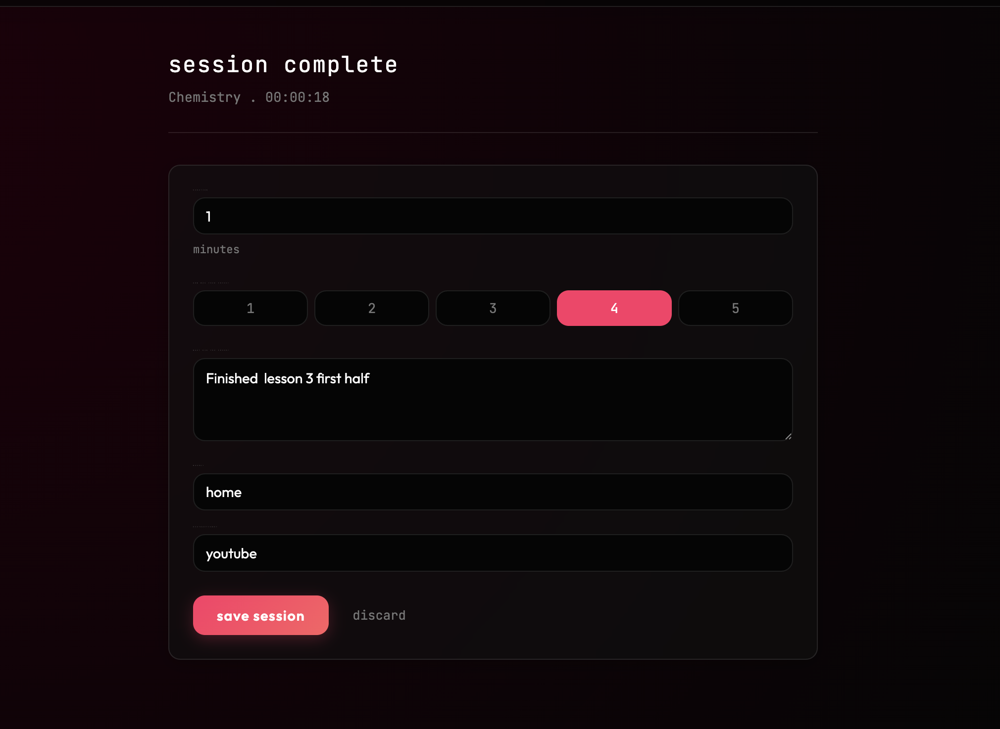
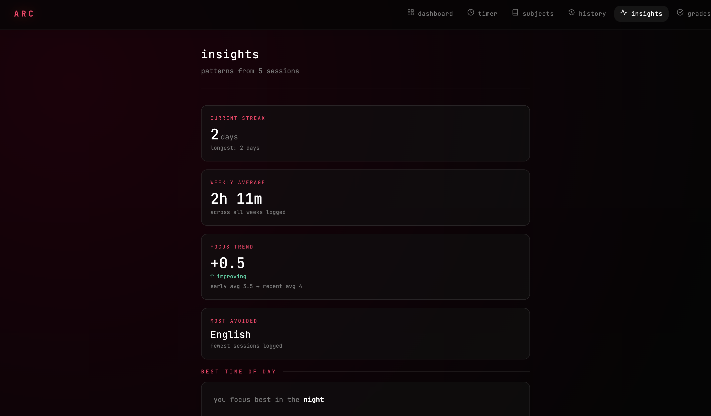
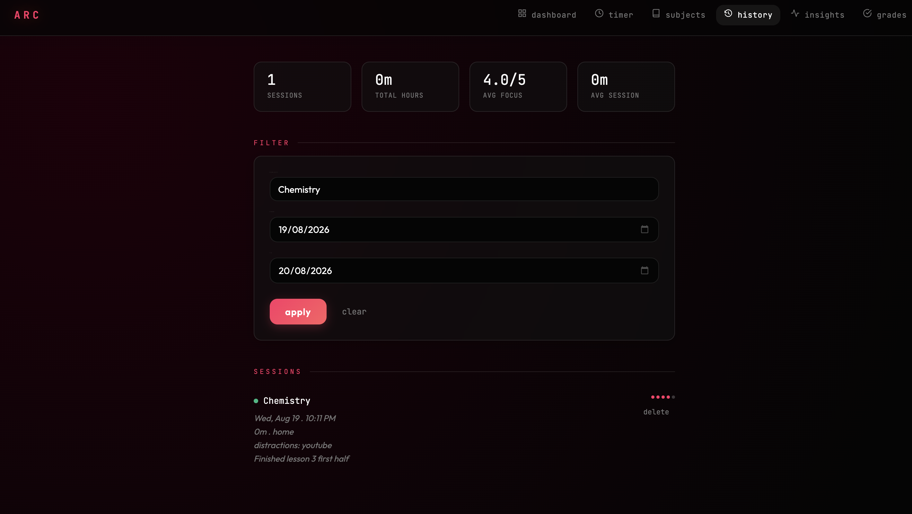
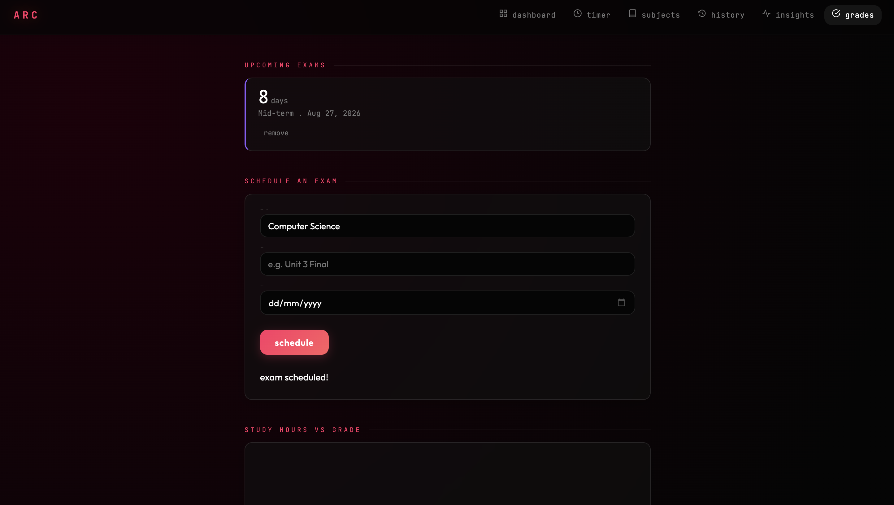

# ARC
> my take on making a minimal and personal dashboard for my productivity tracking.

[**live demo**](https://github.com/Diparsan79)

## what is it?
i built this small corner of mine to track my study hours and hopefully plan the overall academic part of my life. it features different meaningful tools for better productivity like session logging through a timer, detailed insights of your sessions, and grade tracking. 

## why i made it?
After making LIT a terminal based python app , i wanted to learn more deeply by making an full stack app. Thats when i stumbled upon the idea for arc. I have tried many different kinds of study tracker apps but i wanted to make on of my own with my own kinda principles so i made THISSSSS.

## how it was made (tech stack)
- **frontend**: vanilla html, css, javascript
- **backend**: python with fastapi
- **database**: postgresql + sqlalchemy 

## screenshots!
here are some of the coolest parts of the project:

### dashboard
highlights your daily goal, daily logged hours, overall weekly goals, and recent sessions.


### session timer
start logging your study hours from here with the timer.



### logging sessions
when you finish, log your focus level and distractions.


### insights & history
view detailed patterns from your sessions to see when you focus best as well as some other metrics.



### grades & correlation
track your exam grades and see how your study hours correlate to your scores.


##  local setup

here's how you can run this on your machine 

1. **clone the repo**:
   ```bash
   git clone https://github.com/Diparsan79/arc.git
   cd arc
   ```

2. **set up your python environment**:
   ```bash
   python3 -m venv .venv
   source .venv/bin/activate
   ```

3. **install the dependencies**:
   ```bash
   pip install -r requirements.txt
   ```

4. **start the server**:
   ```bash
   uvicorn backend.main:app --reload
   ```

5. **open it up**:
   go to `http://localhost:8000` in your browser and you're good to go!

---

## ai disclosure
- I used ai as a programming mentor helping in different aspects of the site's development
- ai was used to help me structure some of the frontend components and some database structuring
